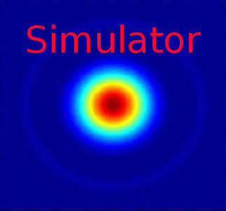

.. _camera-simulator:

Simulator
----------



Introduction
````````````
This is the official Lima camera simulator. It has been made to help you starting with Lima and to test/play Lima without any hardware. 
The simulator is able to provide frames with diffraction patterns and a set of parameters can be tuned to change those patterns
like for instance the number and position of peaks (i.e. FrameBuilder class).

Prerequisite
````````````
There is no special prerequisite, one can compile and test it on both linux and windows platforms.


Installation & Module configuration
````````````````````````````````````

-  follow first the steps for the linux installation :ref:`linux_installation`
-  follow first the steps for the windows installation :ref:`windows_installation`

The minimum configuration file is *config.inc* :

.. code-block:: sh

 COMPILE_CORE=1
 COMPILE_SIMULATOR=1
 COMPILE_SPS_IMAGE=1
 COMPILE_ESPIA=0
 COMPILE_FRELON=0
 COMPILE_MAXIPIX=0
 COMPILE_PILATUS=0
 COMPILE_BASLER=0
 COMPILE_PROSILICA=0
 COMPILE_ROPERSCIENTIFIC=0
 COMPILE_MYTHEN=0
 COMPILE_ADSC=0
 COMPILE_UEYE=0
 COMPILE_XH=0
 COMPILE_XSPRESS3=0
 COMPILE_XPAD=0
 COMPILE_PERKINELMER=0
 COMPILE_ANDOR=0
 COMPILE_PHOTONICSCIENCE=0
 COMPILE_PCO=0
 COMPILE_MARCCD=0
 COMPILE_POINTGREY=0
 COMPILE_IMXPAD=0
 COMPILE_DEXELA=0
 COMPILE_RAYONIXHS=0
 COMPILE_CBF_SAVING=0
 COMPILE_NXS_SAVING=0
 COMPILE_FITS_SAVING=0
 COMPILE_EDFGZ_SAVING=0
 COMPILE_TIFF_SAVING=0
 COMPILE_CONFIG=1
 LINK_STRICT_VERSION=0
 export COMPILE_CORE COMPILE_SPS_IMAGE COMPILE_SIMULATOR \
       COMPILE_ESPIA COMPILE_FRELON COMPILE_MAXIPIX COMPILE_PILATUS \
       COMPILE_BASLER COMPILE_PROSILICA COMPILE_ROPERSCIENTIFIC COMPILE_ADSC \
       COMPILE_MYTHEN COMPILE_UEYE COMPILE_XH COMPILE_XSPRESS3 COMPILE_XPAD COMPILE_PERKINELMER \
       COMPILE_ANDOR COMPILE_PHOTONICSCIENCE COMPILE_PCO COMPILE_MARCCD COMPILE_DEXELA\
       COMPILE_POINTGREY COMPILE_IMXPAD COMPILE_RAYONIXHS COMPILE_CBF_SAVING COMPILE_NXS_SAVING \
       COMPILE_FITS_SAVING COMPILE_EDFGZ_SAVING COMPILE_TIFF_SAVING COMPILE_CONFIG\
       LINK_STRICT_VERSION

-  start the compilation :ref:`linux_compilation`

-  finally for the Tango server installation :ref:`tango_installation`

Initialisation and Capabilities
````````````````````````````````
In order to help people to understand how the camera plugin has been implemented in LImA this section
provide some important information about the developer's choices.

Camera initialisation
......................

The camera will be initialized   within the SimulatorCamera  object. There is no parameters to pass
to the SimulatoCamera() constructor.

This simulator plugin is based on the use of a frame builder class called **FrameBuidler** (SimulatorFrameBuilder.h) on which
you can apply few different settings.
The SimulatorCamera class provides a special method to get the **FrameBuilder** instance (SimulatorCamera::getFrameBuilder()).
Then one can play with few parameters like:

 - setFrameDim(): set a new frame dimension (max. is 1024x1024)
 - setPeaks(): set a list of GaussPeak positions (GaussPeak struct -> x, y, fwhm, max)
 - setPeakAngles(): set a list of GaussPeak angles
 - setFillType():  set the image fill type Gauss or Diffraction (default is Gauss)
 - setRotationAxis():  set the rotation axis policy Static, RotationX or RotationY (default is RotationY)
 - setRotationAngle(): set a peak rotation angle in deg (default is 0)
 - setRotationSpeed(): set a peak rotation speed ixin deg/frame (default is 0)
 - setGrowFactor(): set a growing factor (default is 1.0)
 - setDiffractionPos(): set the source diplacement position x and y (default is center)
 - setDiffractionSpeed(): set the source diplacement speed sx and sy (default is 0,0) 


Std capabilites
................

This plugin has been implement in respect of the mandatory capabilites but with some limitations according 
to some programmer's  choices.  We only provide here extra information for a better understanding
of the capabilities for the simulator camera.

* HwDetInfo
  
 The default (and max.) frame size if about 1024x1024-Bpp32, but one can only change the image type by
 calling DetInfoCtrlObj::setCurrImageType().

* HwSync

  Only IntTrig trigger mode is supported !! 
  For both exposure time and latency time min. is 10e-9 and max. is 10e6.
  
  

Optional capabilites
........................
In addition to the standard capabilities, we make the choice to implement some optional capabilities in order to 
have an improved simulation.

* HwShutter
  The simulator only support ShutterAutoFrame and ShutterManual modes.
  
* HwRoi

  There is no restriction for the ROI.

* HwBin 

  Bin 1x1 or 2x2 only. 

Configuration
`````````````

 No hardware configuration of course !!! 


How to use
````````````
The LimaCCDs tango server provides a complete interface to the simulator plugin so feel free to test.

For a quick test one can use python, is this a short code example:

.. code-block:: python

  from Lima import Simulator
  from lima import Core
  import time

  cam = Simulator.Camera()
  fb = Cam.getFrameBuilder()
  # add a peak
  p1 = Simulator.GaussPeak(10,10,23, 1000) # peak at 10,10 fwhm=23 and max=1000
  fb.setPeaks([p1]) 
  hwint = Simulator.Interface(cam)
  control = Core.CtControl(hwint)

  acq = control.acquisition()

  # setting new file parameters and autosaving mode
  saving=control.saving()

  pars=saving.getParameters()
  pars.directory='/tmp/'
  pars.prefix='testsimul_'
  pars.suffix='.edf'
  pars.fileFormat=Core.CtSaving.EDF
  pars.savingMode=Core.CtSaving.AutoFrame
  saving.setParameters(pars)


  # now ask for 2 sec. exposure and 10 frames
  acq.setAcqExpoTime(2)
  acq.setAcqNbFrames(10) 
  
  control.prepareAcq()
  control.startAcq()

  # wait for last image (#9) ready
  lastimg = control.getStatus().ImageCounters.LastImageReady
  while lastimg !=9:
    time.sleep(0.1)
    lastimg = control.getStatus().ImageCounters.LastImageReady
 
  # read the first image
  im0 = control.ReadImage(0)
  

  
