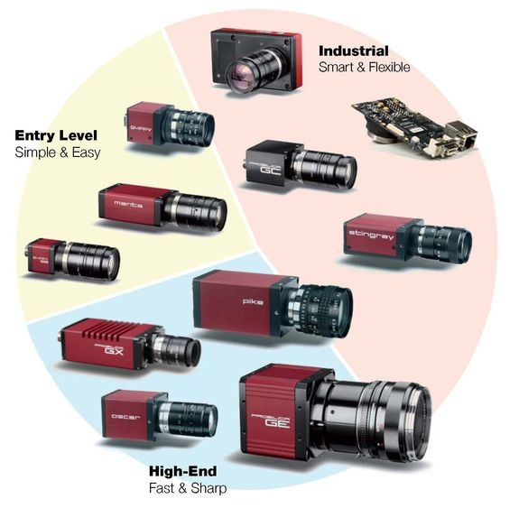

Prosilica
---------



Introduction
````````````

AVT offers a large choice of FireWire and GigE cameras for machine vision, computer vision and other industrial or medical applications. Cameras by AVT and Prosilica include sensitive machine vision sensors (CCD and CMOS, VGA to 16 Megapixels) and fit a wide range of applications.

The Lima module as been tested with color and B/W GigE camera.

Module configuration
````````````````````
The minimum configuration file is *config.inc* :

.. code-block:: sh

  COMPILE_CORE=1
  COMPILE_SIMULATOR=0
  COMPILE_SPS_IMAGE=1
  COMPILE_ESPIA=0
  COMPILE_FRELON=0
  COMPILE_MAXIPIX=0
  COMPILE_PILATUS=0
  COMPILE_BASLER=0
  COMPILE_PROSILICA=1
  COMPILE_CBF_SAVING=0
  export COMPILE_CORE COMPILE_SPS_IMAGE COMPILE_SIMULATOR \
         COMPILE_ESPIA COMPILE_FRELON COMPILE_MAXIPIX COMPILE_PILATUS \
         COMPILE_BASLER COMPILE_PROSILICA COMPILE_CBF_SAVING

See :ref:`Compilation`

Installation
`````````````

- After installing prosilica modules :ref:`installation`

- And probably Tango server :ref:`tango_installation`


Configuration
``````````````

- First you have to setup ip addresse of the Prosilica Camera by using *CLIpConfig* (camera/prosilica/sdk/CLIpConfig)
 - list of all cameras available : *CLIpConfig -l* (If you do not see any camera, that bad news!)
 - finally set ip add : *CLIpConfig -u UNIQUE_NUMBER -s -i 169.254.X.X -n 255.255.255.0 -m FIXED* (It's an example!)

- Then in the Prosilica Tango device set the property *cam_ip_addresse* to the addresse previously set.

That's all....

