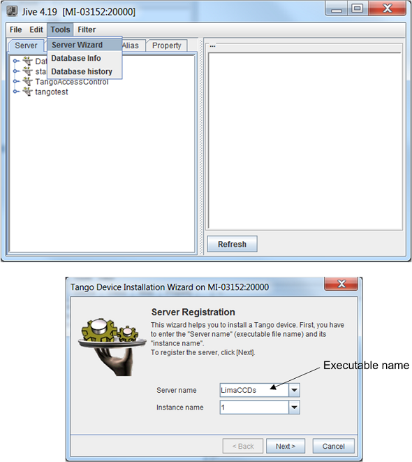
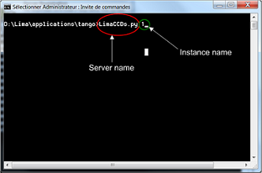
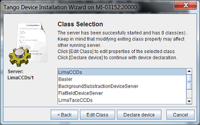
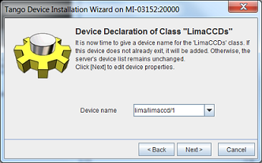
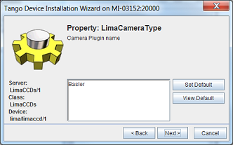
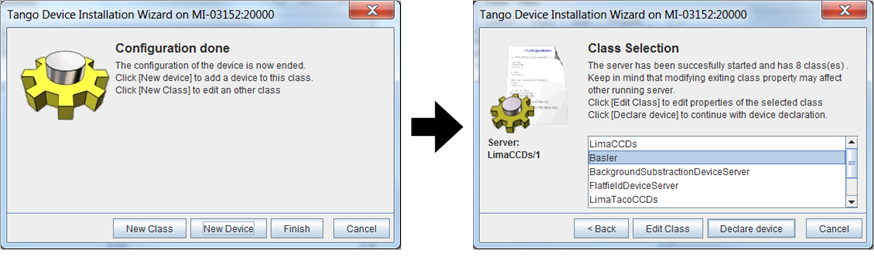
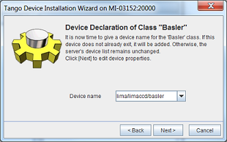
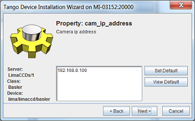

.. _tango_installation:

PyTango Device Server
=====================

Server setup
````````````

As PyTango_ (Tango_ for python) server is provided as Python script, you just have to copy the ``applications/tango/python`` directory wherever you want.

- ``camera`` directory: contained all camera Tango device specifics so remove all none need script
- ``doc`` directory: contained plugins camera documentation (exhaustive list of properties, commands and attributes)
- ``plugins`` directory: contained all plugins device server like:

- Roi counters
- Mask...
- ``scripts`` directory: contained a script use at ESRF to start Lima device server (can also be removed)
- ``LimaCCDs.py`` file: python script to start Lima device server
- ``LimaViewer.py`` file: python script to start LimaViewer device server to get image from Lima device server


.. warning::
  Make sure your environment is properly set for python and library paths, see  :ref:`build_installation` for more information.


Example of plugin server setup : Basler detector
````````````````````````````````````````````````

This procedure described the way to implement basler camera plugin. It is the same for whole the plugins, only properties may change.

You need to create a device server for Lima and another for the camera plugin. Lima device will use basler device thanks to "LimaCameraType" property. This property corresponds to the name of the camera plugin.

Lima device server
^^^^^^^^^^^^^^^^^^

1. Run Jive and select "Tools->Server Wizard" menu. You must enter server and instance names



Click Next...

2. Start the Lima device server. Open a terminal and execute the command "server_name  instance_name"



Click Next on the "Tango Device Installation Wizard" window

3. Declare a Lima device

The Lima device server, contained several classes. For Basler camera you need to configure LimaCCDs and Basler classes.



Select "LimaCCDs" class and click "Declare device" button. You must enter the device name with a string as "Domain/Family/member".



Click Next and configure all the properties. You can let the default property values except for "LimaCameraType". This property must contain the name of the Camera Plugin "Basler".



At the end of the configuration, click "New Class" button.



Select "Basler" class and click "Declare device" button. You must enter the device name with a string as "Domain/Family/member".



Click Next and configure all the properties. You can let the default property values except for "cam_ip_adress". This property must contain the IP adress of the Basler camera.



Configuration is now ended, click "Finish"

.. image:: installation/LimaDeviceServer_9.png


Lima Viewer
^^^^^^^^^^^

To test the Lima device server, you can use the LimaViewer. This is a device server which periodically get the last image from the buffer. It allows the user to check that Lima device server is operational. The procedure below describe how to install and configure the LimaViewer device server.

1. Run Jive and select "Tools->Server Wizard" menu. You must enter server and instance names

    .. image:: installation/LimaViewerDeviceServer_1.png

  Click Next...

2. Start the LimaViewer device server. Open a terminal and execute the command "server_name  instance_name"

    .. image:: installation/LimaViewerDeviceServer_2.png

  Click Next on the "Tango Device Installation Wizard" window

3. Declare a LimaViewer device

  Select "LimaViewer" class and click "Declare device" button.

    .. image:: installation/LimaViewerDeviceServer_3.png

  Enter the device name with a string as "Domain/Family/Member".

    .. image:: installation/LimaViewerDeviceServer_4.png

  Click Next and configure the "Dev_Ccd_name" property. This property corresponds to the name of the Lima device created before.

    .. image:: installation/LimaViewerDeviceServer_5.png

  Configuration is now finished, click on "Finish"

    .. image:: installation/LimaViewerDeviceServer_6.png

Test LimaCCDs device server with Jive
^^^^^^^^^^^^^^^^^^^^^^^^^^^^^^^^^^^^^

The LimaViewer device appears in the Device tab from Jive. Make a right click on the LimaViewer device server and select "Monitor Device"

  .. image:: installation/LimaViewerDeviceServer_7.png

AtkPanel is now launched. You can configure exposure time and the number of frames to acquire.

  .. image:: installation/LimaViewerDeviceServer_8.png

The camera image can be viewed by selecting the "image_ccd" tab

  .. image:: installation/LimaViewerDeviceServer_9.png

.. _Python: http://python.org
.. _PyTango: http://github.com/tango-cs/pytango
.. _Tango: http://tango-controls.org
