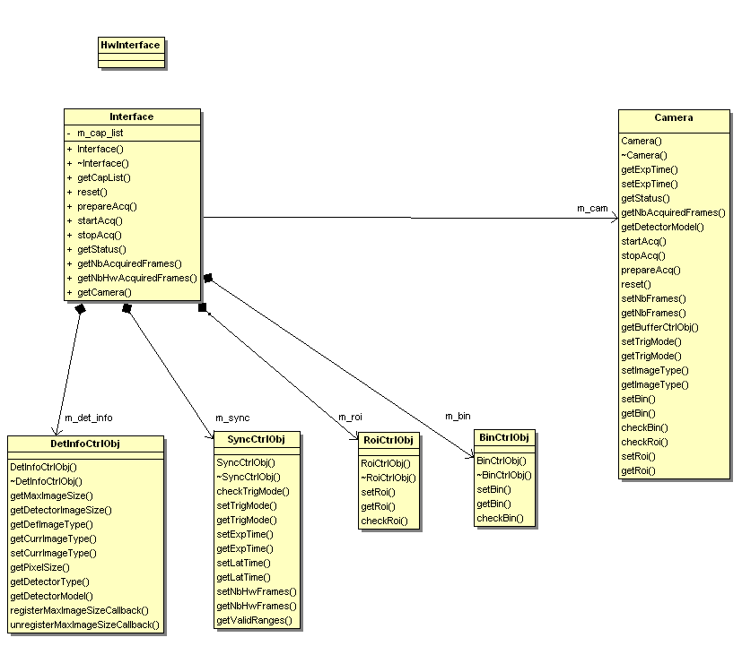
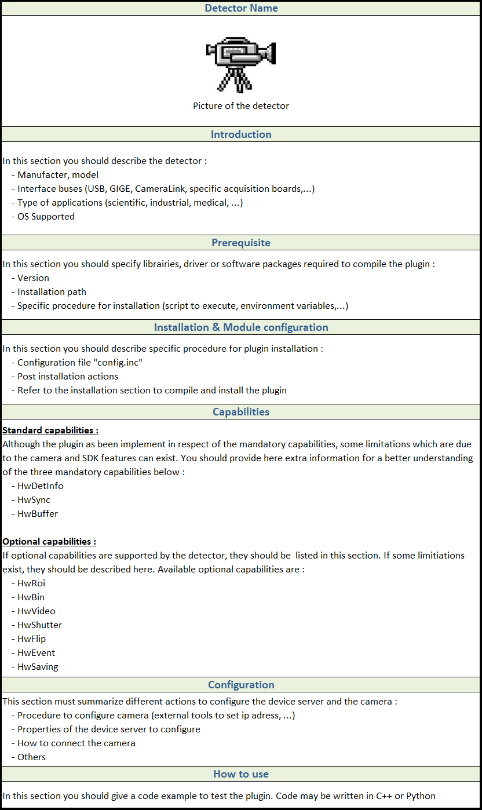

.. _guidelines:

Understand the plugin architecture
==================================

Library structure
------------------

The library structure is divided into two main layers: the control, containing the common control and processing code, and the hardware which is implementing the detector-specific part.
The control layer provides the library interface to the high level application. User requests to configure and control the acquisition are gathered by the control layer,
so the hardware layer functionality is limited to the generation the image frames in a best-effort basis.

The control layer is responsible of:

- Adapting the received image geometry if it does not match the user requests,
- Executing the frame processing chain.

Generic Interface
-----------------

The Hardware Layer defines the interface between the Control Layer and the controller library. It provides the minimal functionality needed for the Control Layer to satisfy the user requests.
The main class in the Hardware Layer is the :cpp:class:`lima::HwInterface`, providing the interface to the Control Layer. In order to provide a flexible and evolvable interface, the configuration of this layer is implemented as a set of features (capabilities) that may or may not be implemented by the hardware.

The capabilities can be grouped in three categories:

1. **Standard.** Includes the synchronization parameters (exposure time, ext. trigger, etc), the detector information (Detector model, Max size, etc..) is considered standard and must be implemented for all detectors.

2. **Extended.** Optional common features like image transformations (binning, RoI, flip), advanced acquisition modes (kinetics, frame transfer), and extended mechanisms (camera serial line)

3. **Specific.** These are detector-specific features that can not be treated in a generic interface

As a camera plugin developer, your mission, should you choose to accept it, will consist in writing the code for the :cpp:class:`lima::HwInterface` class and its depending classes (.e.g the capabilities classes).



    Figure 1. Class diagram of a camera plugin.

Hardware Interface
------------------

:cpp:class:`lima::HwInterface` is the glue layer between the Control Layer and the camera plugin implementation. It informs LImA about the capabilities provided by the hardware.

.. doxygenclass:: lima::HwInterface
    :project: hardware
    :members: getCapList, reset, prepareAcq, startAcq, stopAcq, getStatus, getNbAcquiredFrames, getNbHwAcquiredFrames

The :cpp:func:`lima::HwInterface::getStatus` member function should return the following information:

.. doxygenstruct:: lima::HwInterface::Status
    :project: hardware
    :members:

.. figure:: hw_interface.jpg

    Figure 2. Hardware capabilites block diagram

Standard Capabilities
----------------------

These capabilities are mandatory for all the detectors. They define the minimum functionality necessary for image acquisition.
Three capability classes (DetInfo, Sync and BuffCtrl) are listed below with their set/get methods which have to be provided within the
new camera plugin code.

Detector Information
````````````````````

The interface :cpp:class:`lima::HwDetInfoCtrlObj` returns static information about the detector and the current image dimension.

.. doxygenclass:: lima::HwDetInfoCtrlObj
    :project: hardware
    :members:

.. note:: The :cpp:class:`HwMaxImageSizeCallback` callback functions let the hardware inform the Lima library of a change of the detector maximum image size. This change can happen with some detectors which can be reconfigured with a different geometry. This camera capability is *NOT* a Roi *nor* a Bin capability. For instance, the maxipix detector is a mosaic of several individual sensor chips and it can be configured and reconfigured with different geometries according to user needs. A 2x2 maxipix detector can be configured in a 1x1 geometry.

Synchronization
```````````````

The interface :cpp:class:`lima::HwSyncCtrlObj` controls the acquisition parameters related to synchronization.

================ ======================================================================================================
Parameters       Description
================ ======================================================================================================
set/getExpTime   Frame exposure time
set/getLatTime   Latency time between frames
checkTrigMode    A check method which returns True/False for the supported trigger modes
set/getTrigMode  Triggering mode:
                   * Internal: software triggering
                   * ExtStart: one external signal to start the whole sequence acquisition (one or more frames per
                     sequence)
                   * MultExtStart: one external signal for each frame in the acquisition sequence
                   * Gate: controls start and stop of each frame
                   * ExtStartStop: one start signal to start acquisition of one frame and one signal to stop it
================ ======================================================================================================

Buffer Management
`````````````````

The interface :cpp:class:`lima::HwBufferCtrlObj` controls the image memory buffer allocation and management. They are used:

* As temporary frame storage before saving, allowing disk/network speed fluctuations.
* To permanently hold images that can be read by the user after the acquisition is finished.

These buffer functionalities may be implemented by the hardware layer (kernel driver in the case of the Espia).
If not, an auxiliary buffer manager class will be provided to facilitate (and unify) its software implementation.
The buffer management parameters are:

=============== ======================================================================================================
Parameters       Description
=============== ======================================================================================================
NbBuffers        Number of image buffers in memory.
NbConcatFrames   The number of concatenated frames per buffer.
NbAccFrames      The number of detector frames to accumulate into a single buffer.
MaxNbBuffers     This Read-Only parameter indicates the maximum number of buffers that can be allocated,
                 given the size of the frame and the number of (concatenated) frames per buffer.
BufferMode       Buffer filling mode (linear or circular)
=============== ======================================================================================================

The buffer manager must also provide the following member functions:

* :cpp:func:`lima::HwBufferCtrlObj::getBufferPtr`
* :cpp:func:`lima::HwBufferCtrlObj::getFramePtr`
* :cpp:func:`lima::HwBufferCtrlObj::getFrameInfo`

In most of simple cases, one just need to create a :cpp:class:`lima::SoftBufferCtrlObj` class instance within the Camera class instance
to store the frames. A good example of a simple implementation is available in the Andor camera plugin code.

Frame callback
```````````````

The hardware must provide callbacks after each acquired frame. The callback function should receive the following information:

=============== ======================================================================================================
Parameters       Description
=============== ======================================================================================================
AcqFrameNb       Index of the frame since the start of the acquisition
FramePtr         Pointer to the frame memory
FrameDim         Structure holding the width, height and type of the frame
TimeStamp        Time (in sec.) since the start of the acquisition
=============== ======================================================================================================

The frame callbacks are implemented by means of an auxiliary class :cpp:class:`lima::HwFrameCallback`, which will be used by the Control Layer.
From the Hardware Layer point of view, the standard capability control object must implement two functions:

* setFrameCallbackActive(bool cb_active)
* frameReady(<callback_frame_info>)

Setting up a development environment
====================================

LImA build dependency were updated with the latest version of LImA and that may be an issue on older distro where the tools are not available, namely:

- `CMake`_ >= 3.1
- GCC with C++11 support >= 4.8.1

The first option is to build these packages from source but it is a PITA. One other option is to build with packages managed by `Conda`_ and the following instruction should get you started.

Install Conda
-------------

If you don’t have Conda installed, get `Miniconda`_ and follow the `install instruction <https://conda.io/docs/user-guide/install/index.html>`_.

Create a build environment
--------------------------

A good practice would be not to pollute the base environment and work in a dedicated ``lima`` environment.
Prefer to use mamba tool for package installation rather than the default conda installer, mamba is faster and works better to solve dependencies:

::

   conda create -n lima mamba
   conda activate lima

Conda channels must be defined in the proper order with conda-forge first and prepend to the default anaconda channel:

::
   
   conda config --env --add channels conda-forge
   conda config --env --append channels esrf-bcu
   

Then install the build tools:

For linux
::

   mamba install cmake gxx_linux-64

For windows, just be sure you have visual studio 2017 x64 installed

You might need to leave the `Conda` environment and enter it again so that the environment variables (`CXX`) needed by CMake are set:

::

   conda deactivate
   conda activate lima

Finally, install the ``lima-core`` package (and dependencies) with `Conda`:

::

   mamba install lima-core

If you want to run the LimaCCDs device server on top of your camera plugin we recommend to install the simulator tango package, then you will get installed all the packages by dependencies:

::
   
   mamba install lima-camera-simulator-tango
   
And you are good to code! A good way to start is to use our seed project at:

::

  git clone --bare https://github.com/esrf-bliss/Lima-camera-template.git
  cd Lima-camera-template.git
  git push --mirror https://github.com/esrf-bliss/Lima-camera-mycamera.git

Once you have your new repo ready, clone it and happy coding!

::

  git clone https://github.com/esrf-bliss/Lima-camera-mycamera.git
  cd Lima-camera-mycamera
  git checkout develop

Once you are ready to build, here are the typical `CMake`_ commands for an out of source build (in the `build` folder) and for installing in the current Conda environment (``$CONDA_PREFIX``)

For linux:

::

  cmake -Bbuild -H. -DLIMA_ENABLE_PYTHON=1 -DCAMERA_ENABLE_TESTS=1 -DCMAKE_FIND_ROOT_PATH=$CONDA_PREFIX -DCMAKE_INSTALL_PREFIX=$CONDA_PREFIX
  cmake --build build --target install

For windows:

::

  cmake -Bbuild -H. -DLIMA_ENABLE_PYTHON=1 -DCAMERA_ENABLE_TESTS=1 -DCMAKE_FIND_ROOT_PATH=%CONDA_PREFIX% -DCMAKE_INSTALL_PREFIX=%CONDA_PREFIX%
  cmake --build build --target install --config Release


.. _Conda: https://conda.io/docs
.. _Miniconda: https://conda.io/miniconda.html
.. _CMake: https://cmake.org/

Source code organization
========================

This chapter provides general guidelines to follow, to share a plugin with the community.

Source code
-----------

Plug-ins submodules
```````````````````

The source files and documentation of each new plug-in must be located under Lima/Camera as shown figure below.

::

  ├───camera
      └───mycamera
          ├───cmake
          ├───conda
          │   ├───camera
          │   └───tango
          ├───doc
          ├───include
          ├───python
          ├───sip
          ├───src
          ├───tango
          └───test

To maintain homogeneity between the different plug-ins, each plug-in must have at minimum the following folders:

- ``/src`` : contains the source files. Plug-ins must be developed in C++. The "src" folder must contain the following files :

    - ``DetectorNameInterface.cpp`` : interface class between detector capabilities from the hardware interface and the control layer **(mandatory)**
    - ``DetectorNameDetInfoCtrObj.cpp`` : capabilities to get static informations about the detector **(mandatory)**
    - ``DetectorNameBufferCtrlObj.cpp`` : capabilities to control the image memory buffer allocation **(mandatory)**
    - ``DetectorNameSyncCtrlObj.cpp`` : capabilities to control the image memory buffer allocation **(mandatory)**
    - ``DetectorNameRoiCtrlObj.cpp`` : capabilities to get a ROI **(optional)**
    - ``DetectorNameBinCtrlObj.cpp`` : capabilities to make pixel binning **(optional)**
    - ``DetectorNameVideoCtrlObj.cpp`` : capabilities to make video mode only for non-scientific detectors **(optional)**
    - ``DetectorNameShutterCtrlObj.cpp`` : capabilities to control shutter **(optional)**
    - ``DetectorNameFlipCtrlObj.cpp`` : capabilities to flip image **(optional)**
    - ``DetectorNameEventCtrlObj.cpp`` : capabilities to generate event **(optional)**
    - ``DetectorNameSavingCtrlObj.cpp`` : capabilities to save images in different formats **(optional)**

- ``/include`` : contains the header files relative to the sources files described before.
- ``/doc`` : contains at least ``index.rst`` for plug-in documentation. Other files such as image can be added. The minimum content of the index file is detailed in the documentation section.
- Other folders can be added based on need. The contents of this file must be described in the documentation.


.. note:: If optional capabilities are not defined, they are emulated by the Lima Core.


Camera device
`````````````

Once the plug-in was developed, you must create a camera device to execute all commands on the camera. This device can be developed in Python or C++. Python devices must be located on "Lima/applications/tango/camera", C++ devices on "Lima/applications/tango/LimaDetector"

In order to enhance the general software quality of Device Servers developed by the various institutes using Tango, a Design and Implementation Guidelines document has been written by SOLEIL. This document can be downloaded `here <https://tango-controls.readthedocs.io/en/latest/development/device-api/ds-guideline>`_.

It is recommended that the camera device comply with these design guidelines.

Class names
-----------

Again, to maintain homogeneity, it is recommended to follow this nomenclature for the class names:

* **DetectorName**::Camera

* **DetectorName**::Interface

* **DetectorName**::SyncCtrlObj

* **DetectorName**::DetInfoCtrlObj

As an example, one can look at the Prosilica plugin for a real implementation or at the simulator plugin for a mock implementation.

How to test the new plugin with python
--------------------------------------

In order to communicate with the underlying detector hardware, the lima client must instantiate the main object of the LImA framework  :cpp:class:`lima::CtControl`.
To be instantiated, :cpp:class:`lima::CtControl` requires an interface inherited from common :cpp:class:`lima::HwInterface`.
This interface requires the Camera object that encapsulates dependency with detector and its SDK.

For instance if you are using the python binding for the Prosilica camera, a client application initialization should do:

.. code-block:: python

   from Lima import Prosilica as ProsilicaAcq
   from Lima import Core

   my_prosilica_ip_address = 192.168.1.2
   # we need the camera object first
   camera = ProsilicaAcq.Camera(my_prosilica_ip_address)

   # create the HwInterface which needs the camera as unique parameter
   camera_interface =  ProsilicaAcq.Interface(camera)

   # Now create the :cpp:class:`lima::CtControl` and passed to Lima the new HwInterface
   control = Core.CtControl(camera_interface)

The camera is now under control and it can be used  to acquire images !
First get the sub-objects for the parameter setting of the detector, acquisition, saving and more if necessary.

.. code-block:: python

   acq = control.acquisition()
   saving = control.saving()

   acq.setAcqExpoTime(0.1)
   acq.setAcqNbFrames(10)

   pars=saving.getParameters()
   pars.directory='/buffer/test_lima'
   pars.prefix='test1_'
   pars.suffix='.edf'
   pars.fileFormat=Core.CtSaving.EDF
   pars.savingMode=Core.CtSaving.AutoFrame
   saving.setParameters(pars)

   # pass parameters to camera hw interface
   control.prepareAcq()

   # start the acquisition
   control.startAcq()

.. note:: Camera object is only used to enhance the separation between the generic interface and the API driver of the detector. It is similar to a proxy.

The camera class is also supposed to provide an access to the specific configuration of the detector. For instance if your detector has a threshold setting or a built-in background correction available you should implement these features in the Camera class. The :cpp:class:`lima::HwInterface` will not know about the specific configuration and a client application should explicitly implement the configuration. A good example is the Andor camera, where there are few extra features  like the temperature set-point (set/getTemperatureST()) or the cooler control (set/getCooler(bool)).

With the Andor camera one can set the cooling as:

.. code-block:: python

   camera.setTemperatureSP(-50)
   camera.setCooler(True)

   current_temp = camera.getTemperature()

The Lima project code provides some client application based on TANGO protocol for the remote access.
One can find a python implementation under applications/tango and a C++ version in applications/tango/LimaDetector.
The python server has been developed at ESRF and being used on lot of beamlines and the C++ server is the SOLEIL version which is also used on beamlines.

The ``LimaCCDs`` python server has its own documentation here.

Implementation Recommendations
==============================

Use the `pImpl idiom <https://en.cppreference.com/w/cpp/language/pimpl>`_ to implement the Camera class, breaking compile-time dependency between the vendor SDK and the rest of LImA and downstream applications.

The C++ ABI is sadly [known to be not stable](https://isocpp.org/files/papers/n4028.pdf) between versions of compilers and even between build compiled with the same toolset but different switches. Most vendor SDKs are closed source and cannot be recompiled at will which is the reason why we recommend to use their C version if it exists. Wrapping the C++ API in a C API is a possible workaround.

Write a documentation
=====================

Plugin documentation must be located in "Lima/camera/detector/name/doc". It is composed of at least an "index.rst" file which contains information to install, configure and implement a camera plugin. The presence of this documentation is required to share a plugin with Lima community.

Plugins documentation is available in the section "Supported Cameras".

The table below describes information that must be present in the index file :


